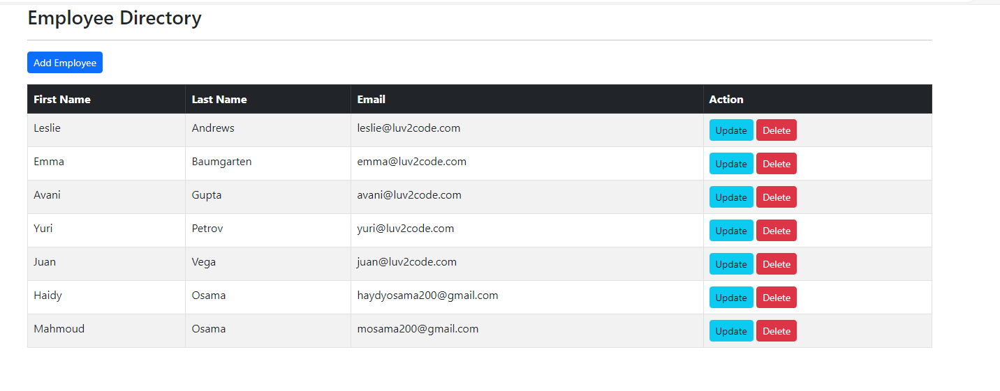

# Employee Directory Project

## Overview
This project is an Employee Directory web application that allows users to manage employee information. The application provides functionalities to add, update, and delete employee records. It is built using the Spring Framework, Thymeleaf template engine, and is connected to a database for persistent storage.




## Features
- **Add Employee:** Allows users to add a new employee to the directory.
- **Update Employee:** Enables users to update the details of an existing employee.
- **Delete Employee:** Provides functionality to delete an employee from the directory.
- **View Employees:** Displays a list of all employees with their first name, last name, and email.

## Technologies Used
- **Spring Framework:** Used for dependency injection, transaction management, and to build the overall structure of the application.
- **Thymeleaf:** A template engine used for rendering dynamic web pages.
- **Spring Data JPA:** For database operations.
- **Database:** An in-memory database used for development and testing.
- **Maven:** For project build and dependency management.


## Setup and Installation

### Prerequisites
- Java Development Kit (JDK) 11 or higher
- Maven 3.6.0 or higher

### Steps to Setup
1. **Clone the repository:**
    ```bash
    git clone https://github.com/your-repository/employee-directory.git
    cd employee-directory
    ```

2. **Build the project using Maven:**
    ```bash
    mvn clean install
    ```

3. **Run the application:**
    ```bash
    mvn spring-boot:run
    ```

4. **Access the application:**
   Open a web browser and go to `http://localhost:8080`.


